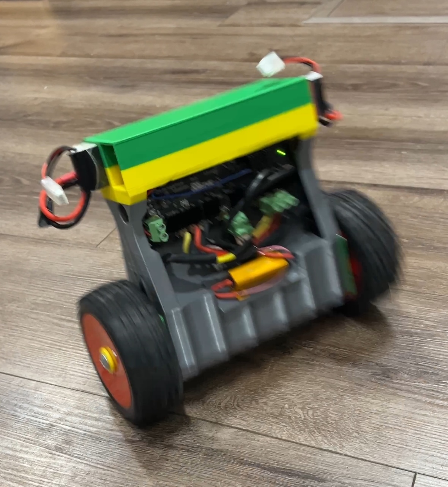
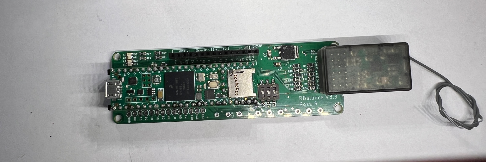

# BalanceBot

As seen in my video : https://www.youtube.com/watch?v=k_vYA-xRXyo

Experience unparalleled speed with our servo-powered balance bot, engineered for performance and precision.

## Hardware Components

- **Teensy 4.1:** The brain of the bot. Available [here](https://amzn.to/48WA4g9).
- **Rbalance 3v3 Board:** My custom design that seamlessly integrates essential components for balance bot projects, including:
  - Direct support for Teensy 4.1.
  - 4 LED indicators.
  - An onboard MPU6050 accelerometer/gyro with optimal orientation (I2C address 0X69).
  - Three potentiometers positions
  - Four DIP switches for quick configuration changes.
  - A 2.2K-ohm resistor-protected serial 3 port to safeguard against potential Odrive and Teensy damage.
  - Voltage divider analog inputs for monitoring battery levels (up to 12V and 24V).
  - Two outputs for R/C servos.
  - Six-channel input for voltage-divided R/C receiver signals (allowing direct receiver connection).
  - Shoot Me an email at ASKGDFW@gmail.com if you'd like to purchase the Rbalance3v3. Cost is $75.
- **Odrive 3.6 24V:** For precise motor control.
- **Motors:** 2x 5065 Dual shaft Brushless Outrunners. Available [here](https://odriverobotics.com/shop/odrive-custom-motor-d5065).
- **Encoders:** 2x with cables for accurate position feedback. Available [here](https://odriverobotics.com/shop/cui-amt-102).
- **Batteries:** 2x 2200mAh 3S LiPo for reliable power. Available [here](https://amzn.to/499Znei).
- **Connectors:** Deans Connectors for secure electrical connections. Available [here](https://amzn.to/2YnCuje).
- **R/C System:** Transmitter and Receiver with channels 5 and 6 as potentiometers (also can be used for tuning PID). Available [here](https://amzn.to/42nNXkN).
- **Wheels:** Durable and smooth-running. Available [here](https://amzn.to/3uswwTA).
- **3D Printed Parts:** Custom-designed components from Fusion 360.

## Rbalance 3v3

## Wiring and Connections

Wiring your BalanceBot correctly is crucial. To streamline this process, we're excited to introduce the RBalance 3v3 board, avaliable directly from me email askgdfw@gmail.com. This board is designed to minimize the complexity of connections, and create short wiring between the MPU6050 and the Teensy, preventing noise from the Odrive from taking down the I2C bus.

With the RBalance 3v3, you'll need to make only a few critical connections:
- Connect the ground from the Odrive to both the Teensy and the 24V batteries. This ensures a common ground for all components.
- Link both batteries in series to the Odrive. Connect the +12V from the first battery in series to the 24V sense pin on Rbalance, this will feed a lower voltage to the regulator, lessening the thermal load for it. 
- Do NOT Power the 5V bus on the RBalance 3v3 with the Odrive. 
- Finally, connect the motors and encoders to the Odrive.

Choosing the RBalance 3v3 eliminates the need for intricate wiring for the MPU6050 and other components, offering a cleaner, more reliable connection that significantly enhances the bot's performance. Without the RBalance 3v3, you would need to undertake the complex task of wiring the MPU6050 directly, which can lead to signal interference from the drive and compromise the MPU6050's functionality. While assembling the bot without the RBalance 3v3 is possible, the RBalance 3v3 board is designed to make the process much more straightforward.

## Software Guidelines

While the provided code is not meant for direct replication in every project, here are key adjustments and installations necessary for optimal performance:

1. **PID Library Modification:** Replace your existing PID library with mine to leverage enhancements for managing integral windup in the control loop.
2. **MPU6050 Library:** Install the necessary library to utilize DMP mode, available [here](https://github.com/jrowberg/i2cdevlib).
3. **DMP Calibration:** Use the provided example code for calibrating the MPU6050, substituting the calibration values with those specific to your setup.
4. **Firmware Compatibility:** The code is tailored for an Odrive 3.6 with firmware version 0.5.6, but you will need to recalibrate your motors. 

For those looking to contribute to the software or replicate the setup accurately without knowledge of PID tuning, ensuring that your hardware configuration is identical to mine is crucial for success.

## Amazon Be Happy
We are a participant in the Amazon Services LLC Associates Program, an affiliate advertising program designed to provide a means for us to earn fees by linking to Amazon.com and affiliated sites.
